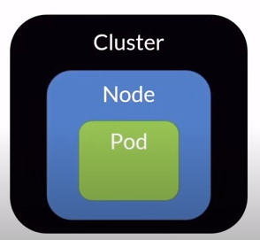

# Docker

## Containerization
1. The way to setup codebases, tools, dependencies, etc and run project is different for different systems.
2. It helps define project configuration in a single file - Docker File
3. Helps running project in an isolated environment
4. A container is a unit of deployment that contains everything needed for the code to run. 

## Why Containers
1. We can deploy smaller units and move faster
2. They use fewer resources
3. Faster Automation
4. Portability, Isolated, Scalable
5. Fit more into the same host

## VM vs Container

1. VM runs directly on the hardware, and OS is installed.
2. Container images are run in memory. Compared to VM, containers dont need to boot, they run directly in host OS kernel. They use less memory and space.

3. We can fit more containers in the same host than VMs.

## Docker Installation
1. Install docker
2. Run the following command to verify installation - `docker run hello-world`.
3. This should show "Hello from Docker!"
4. Check `docker` to check its cli.

## Docker
There are three main parts in docker
1. CLI
	1. The command line interface that allows us to run commands
	2. 
2. Engine
	1. The engine runs the commands.
	2. This helps us create images, run commands, etc.
	3. Called the docker-daemon
3. Registry (Docker Hub)
	1. To host docker images
	2. You can push your image to dockerhub and other services can pull this image from Docker Hub

### Images Vs Containers
Images are the templates from which containers are created.


### Dockerfile
This is a text file listing the steps to build an image.  
Docker config is stored in a file called `Dockerfile`.  
This dockerfile describes how the image is supposed to run.
  
1. The first line is `FROM <something>`. The `<something>` is called the `base image`. This base image represents from where we are building it.  
```
FROM node:20
WORKDIR <path>
COPY . .
RUN npm install
EXPOSE 3000
CMD ["node", "index.js"]
```
2. `WORKDIR` sets what is the working directory.
3. `COPY . .` everything from here to docker image, to the working directory.
4. `npm install` just installs external dependencies in package.json
5. `.dockerignore` is similar to gitignore. These wont be added to image.  
6. `EXPOSE 3000` just exposes that particular port.
7. `CMD` set of commands that need to be run when we are running the container. This runs when we are actually starting the container.
8. **Tagging** -  We name an image optionally with a tag. The tag is usually the version number. 

**Build an Image** - `docker build . -t <image-name>`  
**List Images** - `docker images`  
**Run Image** - `docker run <image-name>` , alternatively `docker run -p 3000:3000 <image-name>` - this means that whatever request comes to machine 3000 port. forward to 3000 port of this image. We can use a `-d` flag which is detached mode, means that the terminal will not be hung with that container and we can run new commands in the same container.  
**Check current running status** - `docker ps`
**Stop container** - `docker stop <container-name>`. We can alternatively use `kill` to force stop a container.  
**Delete an image** - `docker rmi <image-name>`

### Push images to dockerhub
1. Signup in dockerhub
2. docker images are of the form username/imagename
3. login using `docker login`
4. To push, use `docker push <name>`
5. To pull, use `docker pull <name>`

Each step in dockerfile is a layer. During build each layer gets cached. If a layer gets uncached (changed), every layer after this needs to be re run and cached.  

## Volumes and Networks
1. We need volumes persist data. Once we shutdown a container and if there is any db in that container, all the data will be lost in restart.
2. We need networks so that one container can talk to another container. 


### Volume

A volume is a logical space where we can dump data from a container. If the container shuts down, the volume will remain the same until the volume is also shut down.  
**Create a volume** - `docker volume create <volume-name>` - this creates volume inside docker engine.  
**Delete a volume** - `docker volume rm <volume-name>`  
**Add volume to an image** - `docker run -v <volume_name>:<db folder> -p <port_a>:<port_b> mongo` - here , the db folder is the folder where data is dumped inside the container. This is different for different dbs.  
**List Volumes** - `docker volume ls`  
**SSH inside a container** - `docker exec -it <image-id> /bin/bash`  
**Attach volume to an image** - `docker run -d --name <container-name-we-give> -v <vol-name>:/<folder-path in image> <image-name>`

Instead of volumes, we can use local folders for the purpose of testing.

### Networks
Since each container has its own network, we cant directly interact with another container through ports (since each container looks for the port within itself). This is where we use networks for communication between two containers.  
1. First create a network - `docker network create <network-name>`
2. List networks - `docker network ls`
3. When running a container, give it a name and attach it to a network - `docker run -p 3000:3000 --name <name> --network <network-name> <image-name>`
4. Now, we have a database and a backend container, in backend container we connect to db using the following code (mongo example) - `mongoose.connect("mongodb://localhost:27017/db, {});`. This needs to be replaced with `mongoose.connect("mongodb://<container-name>:27017/db, {});` if they are in the same network. 
 


### Dependencies
1. When running multiple containers, we need to make sure that the containers are run in the correct order. For this, we can use `depends_on` in docker-compose.yaml.


## Environment Variables
These are config secret variables that need to be hidden while in production or anywhere else, eg - db urls, etc.  
We can add env variables by - `docker run -p 800:800 -e <var-name>=<value> `. 

## Multi Stage Builds
The file running will be different in dev and prod (eg - debug true and false, etc). 
```
FROM node:20 AS base
WORKDIR /usr/src/app
COPY package*.json ./
RUN npm install

FROM base AS development
COPY . .
CMD ["npm", "run", "dev"]

FROM base AS production
COPY . .
RUN npm prune --production
CMD ["npm", "run", "start"]
```
Here, line 1-4 builds the image as base. The dev and prod are run as per the base image.  
To run dev, use - `docker build . --target development -t app:dev`, run with `docker run app:dev`

## Docker Compose

It lets us compose a bunch of images together. Through compose, we use a single YAML file to describe all the applications services. So, with a single command, all the services will be run.	
```
services:
  mongodbi_db:
    image: mongo:latest
    ports:
      - "27017:27017"
    volumes:
      - mongodb-data:/data/db
  custom_app:
    build: ./
    ports:
      - "3000:3000"

volumes:
  mongodb-data:
 ```
1. The file name would be `docker-compose.yaml`  
2. To run this, run `docker-compose up`  
3. When we use docker-compose, all the services inside it are already connected by a network
4. The build command in docker-compose.yaml is used to build the image from the dockerfile in the directory path given. `.` means the current directory.
5. We can setup resource limits by:

6. We can setup environment variables by:

7. These env variables can be overriden in the command line by `-e` flag.

8. We can also add the env variable in the machine itself and access that variable using `${env-var-name}`. We can also put all these vars in a `.env` file and access them using `${env-var-name}`. Docker compose knows to look for these in the .env file. 

## Container Registries
1. These are central repositories where we can store our images.
2. We have registries like dockerhub, AWS ECR, etc.
3. Publish using:


## Docker Commands
1. `docker info` - gives info about docker installation in the machine
2. `docker version` - gives version of docker
3. `docker login` - log in into docker registry
4. `docker pull [imagename]` - pull an image from docker registry
5. `docker run [imagename]` - run an image
6. `-d` flag runs the container in detached mode, so it is run in the background
7. `docker start [containername]` - start a container in stop state
8. `docker stop [containername]` - stop a container, it will still be in memory
9. `docker ps` - list all running containers, `-a` flag lists all containers running and stopped
10. `docker rm [containername]` - remove a container, the container should be stopped
11. `docker rmi [imagename]` - remove an image
12. `docker kill [containername]` - kill a container
13. `docker image inspect [imagename]` - get all information about an image
14. `docker system prune -a` - remove all stopped containers, all dangling images, all unused networks, all build cache
15. `docker build -t [name:tag] .` - build an image from dockerfile in the current directory. The `.` represents the current directory
16. `docker build -t [name:tag] -f [filename] .` - build an image from dockerfile from a different folder
17. `docker tag [imageid] [name:tag]` - tag an image. Tag is usually used to specify the version number.
18. `docker exec -it <image-id> /bin/bash` - ssh into a container. The `-it` flag is used to run the container in interactive mode. The `/bin/bash` is the command to run.
19. `docker create volume [name]` - create a volume
20. `docker volume ls` - list all volumes
21. `docker volume inspect [name]` - get info about a volume
22. `docker volume rm [name]` - remove a volume
23. `docker run -v [volume-name]:[db folder] -p [port_a]:[port_b] [image-name]` - run an image with a volume
24. `docker volume prune` - remove all unused volumes and not mounted
25. `docker compose up -d` - build and run all services in docker-compose.yaml
26. `docker compose build` - build all services in docker-compose.yaml
27. `docker compose start` - start all services in docker-compose.yaml
28. `docker compose stop` - stop all services in docker-compose.yaml
29. `docker compose down` - stop and remove all services in docker-compose.yaml
30. `docker compose ps` - list all services in docker-compose.yaml
31. `docker compose logs` - list all logs of all services in docker-compose.yaml
32. `docker compose rm` - remove all stopped containers in docker-compose.yaml
33. `docker compose exec [service-name] [command]` - run a command in a service in docker-compose.yaml
34. `docker compose -p [project-name] up -d` - run all services in docker-compose.yaml with a project name, this helps in running multiple docker-compose.yaml files in the same machine
35. `docker compose ls` - list all running projects
