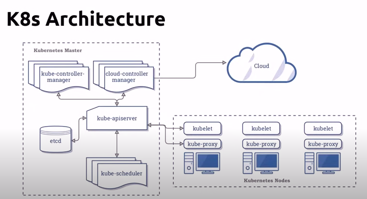
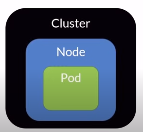
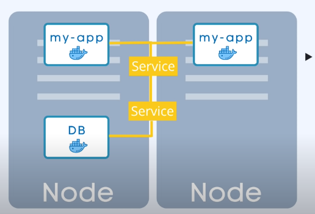

# Kubernetes

## Intro
1. This is a container orchestration tool. It is used to manage containers, in different environments.
2. Kubernetes can
    1. Service discovery and load balancing
    2. Storage orchestration
    3. Automated rollouts and rollbacks
    4. Automatic bin packing
3. Kubernetes cannot
    1. Provision machines
    2. Configure network
    3. Install OS, applications like dbs, caches, etc
    4. Cannot deploy source code
    5. Cannot build apps

4. The master node is called the control plane
5. The worker nodes are called the data plane
6. The control plane runs the services and controllers
7. A container runs in a pod, a pod runs in a node, a node runs in a cluster.
8. The architecture of kubernetes is as follows
    1. There is atleast one master node and it connects to a  bunch of worker nodes
    2. Each node has a kubelet process running on it
    3. The kubelet process is responsible for communicating with the master node 
    4. Each worker node has containers of the application running on it, depending on the workload distribution, the containers can be distributed across multiple nodes
    5. Worker nodes are where the actual containers are run, while master node is responsible for the orchestration of the containers
    6. The master node has a kube-apiserver, which is responsible for communicating with the kubelet process on the worker nodes. This api server is the point of contact for all the communication. 
    7. The master node has a controller manager, which is responsible for managing the controllers. The controllers are responsible for managing the state of the cluster.
    8. The master node has a scheduler, which is responsible for scheduling the containers on the worker nodes, based on the resource availability and workload distribution.
    9. The master node also has a etcd database, which is a key value store, which stores the state of the cluster. It stores the state of the cluster, the configuration of the cluster, the state of the nodes, the state of the pods, etc. It holds at current time, the entire state of the cluster. Backup and recovery is done through the etcd snapshots. 
    10. Another important part of master node is the virtual network, which is used for communication between the master node and the worker nodes. It spins all the nodes that are part of the cluster. It creates a unified machine of all the worker nodes. 
    11. Worker nodes are bigger and have more resources than the master node.

### Nodes and Pods
1. A node is simply a machine, a virtual machine or a physical machine.
2. The smallest unit of kubernetes is a pod.
3. A pod is an abstraction over a container. It helps in so that the container can be a docker container or a rkt container or any other container.
4. A pod can have one or more containers. Usually it is one container per pod.
5. Each pod has a unique IP address. Communication between pods is done through the IP address.
6. Pods are ephemeral, they can be created and destroyed at any time.
7. Pods are not self healing, if a pod dies, it is not restarted automatically, when a new pod is created, it is given a new IP address.
8. Pods are not horizontally scalable, if a pod is overloaded, a new pod is created, but the load is not distributed between the pods.

### Services
1. A service is a permanent IP address that can be attached to a pod.
2. The lifecyles of service and pod are not connected, they are independent of each other. So if a pod dies, a new pod can be attached to the service and the service will still be available.
3. We create an external service to open commucation between the pod and the outside world.
4. We create an internal service to open communication between the pods. It is also a load balancer

### Ingress
1. Ingress is a way to expose the service to the outside world.
2. It is a load balancer that sits in front of the service.
3. The request comes to the ingress, which then forwards the request to the service, which then forwards the request to the pod.

### ConfigMaps
1. ConfigMaps are used to store configuration data.
2. The configuration data can be stored in a file or as a key value pair.
3. The configuration data can be stored in a configmap and then the configmap can be attached to the pod.
4. For storing sensitive configuration data, we use secrets.
5. Encryption is done by third party tools like vault.

### Volumes
1. Volumes are used to store data.
2. These store persistent data. It attaches a physical storage to the pod.

### Deployment and StatefulSets

1. We create a blueprint of the pod, which is called a deployment, and we define the number of replicas of the pod that we want.
2. In practise, we create a deployment and then we create a service, which is attached to the deployment.
3. Deployments is an abstraction over pods.
4. We cant replicate a database using deployments, because the pods are not stateful, they are stateless.
5. We use statefulsets to replicate databases.
6. Statefulsets are an abstraction over pods, but they are stateful.
7. It is a better practice to run stateless applications in kubernetes, because it is easier to scale them, and stateful applications with a different service.

## Configuration
1. All the configuration goes to the master node through api-server.
2. The request should be in yaml or json
3. The important parts of a configuration are
    1. apiVersion - The version of the api that we are using
    2. kind - The kind of object that we are creating
    3. metadata - The metadata of the object, contains name, etc.
    4. spec - The specification of the object. This includes selectors, ports, replicas, etc.
    5. status - This is the status of the object. This is not part of the configuration, but is returned by the api server. This is managed by kubernetes, this makes sure that the state Is==should. If the state is not equal to the should, then kubernetes will make the state equal to the should. This is called self healing.
4. Minikube is used to run kubernetes locally. It runs a single node cluster inside a virtual machine.
5. Kubectl is a command line tool that is used to interact with the cluster. This cli tool is used to interact with the api server.
6. There are 2 layers of docker with minikube. As we know, minikube is used to run docker containers in pods, but locally, minikube runs as a docker container itself. So there are 2 layers of docker. The first layer is the docker container that is running minikube, and the second layer is the docker container that is running the pod.

## Commands
1. `minikube start --driver docker` - Starts the minikube cluster with docker as the driver
2. `minkube status` - Gives the status of the minikube cluster
3. `kubectl get nodes` - Gives the nodes in the cluster
4. `kubectl cluster-info` - Gives info about the cluster
5. `kubectl get pods` - Gives the pods in the cluster
6. `kubectl apply -f <filename>` - Applies the configuration in the file to the cluster
7. `kubectl get all` - Gives all the objects in the cluster
8. `kubectl delete -f <filename>` - Deletes the configuration in the file from the cluster
9. `kubectl describe <object> <name>` - Gives the description of the object
10. `kubectl get <object>` - gives info on the object
11. `kubectl logs <podname>` - Gives the logs of the pod
12. `kubectl exec -it <podname> -- <command>` - Executes the command in the pod
13. `kubectl get svc` - Gives the services in the cluster