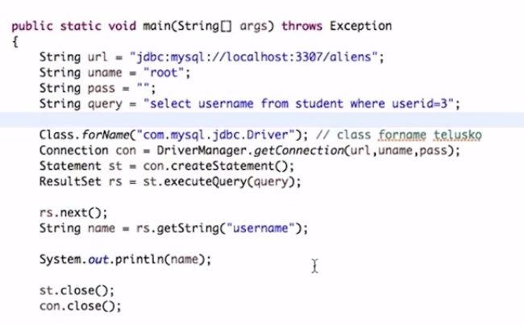

# JDBC

1. JDBC stands for Java Database Connectivity.
2. There are 4 types of JDBC drivers:
    1. Type 1: JDBC-ODBC Bridge Driver
    2. Type 2: Native-API Driver
    3. Type 3: Network Protocol Driver
    4. Type 4: Thin Driver

## Steps to connect
1. Import the package (java.sql.*)
2. Load and register the driver - There are different drivers for different databases. For MySQL, the driver is `com.mysql.jdbc.Driver`. For Oracle, the driver is `oracle.jdbc.driver.OracleDriver`. For SQL Server, the driver is `com.microsoft.sqlserver.jdbc.SQLServerDriver`.
    1. Load - Download the jar file and add it to the classpath.
    2. Register - Use `Class.forName("com.mysql.jdbc.Driver")` to register the driver.
3. Establish the connection
4. Create the statement
    1. Normal statement - 
    2. Prepared statement - For parameterized queries
    3. Callable statement - for PL/SQL
5. Execute the query
6. Process the results
7. Close the connection

1. We can use `executeQuery()` method to execute the select queries. This returns a resultset.
2. We can use `executeUpdate()` method to execute the insert, update, delete queries. This returns the number of rows affected.
3. We can use `execute()` method to execute any type of query.
4. The syntax for prepared statement is `PreparedStatement ps = con.prepareStatement("insert into emp values(?,?)")`. We can set the values using `ps.setInt(1, 101)` and `ps.setString(2, "Ratan")`. We run this by `ps.execute()`.