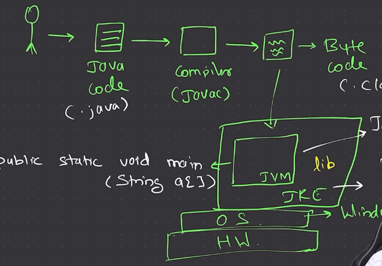

# Java

## Basics
1. We can run java code in cmd using **JShell**. Run `jshell` in cmd for an interactive java environment in cmd. You can exit jshell by typing `/exit` in the prompt.
2. Extension is `.java`
3. Running java files is a 2 step process
    1. Compile the file using `javac filename.java`. This generates class files.
    2. Run the compiled file using `java classname`

4. JVM is platform dependent, but Java is platform independent. JVM looks for the signature `public static void main(String[] args)` to start the execution of the program.
5. JDK has JRE and JRE has JVM. Java is WORA (Write Once Run Anywhere) because of JVM.
6. Java is case sensitive and strongly typed language.
7. Java is a compiled language, but it is also an interpreted language. Java code is compiled to bytecode and then interpreted by JVM.
8. We can try `java filename.java` to run the file directly. This will compile and run the file in a single step.

### Data Types
1. Primitive: int(4), float(4), double(8), char(2), boolean, byte(1), short(2), long(8)
2. Non-Primitive: String, Array, Class
3. Formula for range: -2^(n-1) to 2^(n-1)-1
4. Default value of int is 0, float is 0.0, char is \u0000, boolean is false, reference types are null.
5. By default, the decimal values are double in java. To make them float, we need to add `f` at the end of the value.
6. We can use underscore in numeric literals for better readability. `int a = 1_00_000;`
7. Java follows Unicode character set instead of ASCII. `char a = '\u0061';` is same as `char a = 'a';`. 
8. For characters we use single quotes and for strings we use double quotes. `char`
9. For boolean, we can use `true` or `false` only. We cannot use 0 or 1. `bool`
10. For every long value, we need to add `L` at the end of the value. `long l = 100000000000L;`
11. We can increment and decrement the value of a character. `char a = 'a'; a++;` will make `a` as `b`.

#### Type Casting
1. Implicit: `int a = 10; long b = a;` is valid because long can store int.
2. Explicit: `long a = 10; int b = (int) a;` is valid because we are explicitly casting long to int.
3. When we explicitly cast a float to int, the decimal part is truncated. `int a = (int) 10.5;` will make `a` as `10`.
4. When we cast a char to int, the ASCII value of the character is stored in the int. `int a = (int) 'a';` will make `a` as `97`.
5. When we cast a boolean to int, `true` will be 1 and `false` will be 0. `int a = (int) true;` will make `a` as `1`.
6. When we cast a larger data type to a smaller data type, the value is wrapped around. `byte a = (byte) 130;` will make `a` as `-126`. We use the modulo operation to wrap around the value. Here 130%256 = -126.
7. **Type Promotion**: When we perform operations on different data types, the smaller data type is promoted to the larger data type. `int a = 10; float b = 20.5f; float c = a+b;` is valid because `a` is promoted to float.

#### Logical Operators
1. `&&` and `||` are short circuit operators. If the first condition is false in `&&`, the second condition is not checked. If the first condition is true in `||`, the second condition is not checked.
2. `&` and `|` are non-short circuit operators. Both the conditions are checked.
3. `!` is the logical NOT operator. It is used to reverse the logical state of its operand. If a condition is true, then the logical NOT operator will make it false.
4. `^` is the logical XOR operator. It returns true if and only if the operands are different.
5. `a && b` is same as `a & b` if `a` is true. If `a` is false, `a && b` is false and `a & b` is false.
6. **Ternary Operator**: `int a = 10; int b = 20; int c = (a>b)?a:b;` will make `c` as `20` because `a` is not greater than `b`. The syntax is `condition?value1:value2`. If the condition is true, `value1` is assigned to the variable, else `value2` is assigned to the variable.

#### Switch Statement
1. The switch statement is a multi-way branch statement. It provides an easy way to dispatch execution to different parts of code based on the value of the expression.
2. The expression must be of type `byte`, `short`, `int`, `char`, `String`, or an enum.
3. The case value must be a literal or a constant expression.
4. The default case is optional.
5. Example: 
```
int a = 10;
switch(a){
    case 10: System.out.println("10");
    break;
    case 20: System.out.println("20");
    break;
    default: System.out.println("Default");
}
```
6. The break statement is used inside the switch to terminate a statement sequence. When a break statement is encountered, the switch terminates, and the flow of control jumps to the next line following the switch statement.

#### Loops
1. **For Loop**: `for(int i=0;i<10;i++)`. The initialization, condition, and increment/decrement are separated by semicolons.
2. **While Loop**: `while(condition)`. The condition is checked first and then the statements are executed.
3. **Do While Loop**: `do{statements}while(condition)`. The statements are executed first and then the condition is checked.

