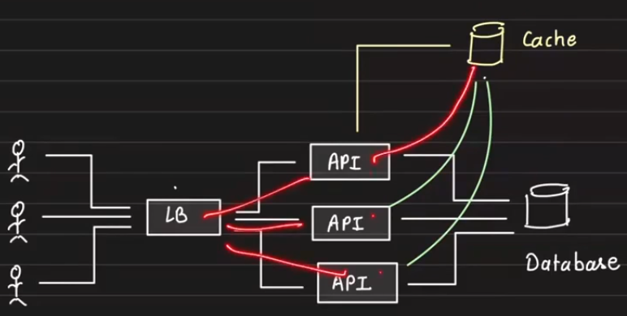

# Lecture 1 - Foundational Topics

## Tips
1. Decide the core of the system, this could be anything - database, socket, etc.
2. Then we build the system around it in a spiral manner.
3. See how it behaves under load and then at scale, identify bottlenecks and then optimize them.

## Fundamentals
Core components of most of the systems  
1. Database
2. Scaling
3. Concurrency
4. Caching
5. Delegation
6. Communication

### Database
1. Soft deletes: We need soft deletes for recovery, archival and audit. We also do soft deletes for performance reasons. When we hard delete, the data gets deleted from a B+ tree, which needs the tree to rebalance, which is CPU intensive.
2. Short v Long Texts: In datbases, for short text vs long text, short text is stored in the row itself, while long text is stored in a file in the disk and the row contains the pointer to the file.
3. Time: We have mutliple ways to store datetime, we have datetime, epoch and custom format. We find how the database internally stores it in the disk, and if it not working well, we need to store it in an optimal way.
    1. Datetime: Native in db, but the data is flushed into disk in a some format, and when reading, it is serialized back into datetime. For eg, datetime is stored as a string in the disk, everytime we read, we need to parse it back into datetime. This is expensive.
    2. Epoch: We store the datetime as a number, which is the number of seconds since 1st Jan 1970. This is also space efficient compared to datetime. But, this is not readable.
    3. Custom format: We store the datetime in a custom format, which is readable and also space efficient. Redbus stored their date in YYYYMMDD integer for simple optimistion.

### Caching
1. Caching is the any method used to save resources from an expensive operation by storing it. It reduces disk I/O, compute I/O and network calls. 

