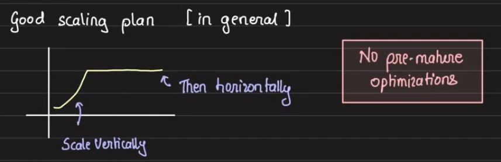
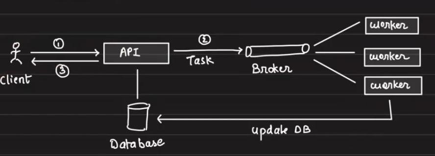

# Lecture 1 - Foundational Topics

## Tips
1. Decide the core of the system, this could be anything - database, socket, etc.
2. Then we build the system around it in a spiral manner.
3. See how it behaves under load and then at scale, identify bottlenecks and then optimize them.

## Fundamentals
Core components of most of the systems  
1. Database
2. Scaling
3. Concurrency
4. Caching
5. Delegation
6. Communication

### Database
1. Soft deletes: We need soft deletes for recovery, archival and audit. We also do soft deletes for performance reasons. When we hard delete, the data gets deleted from a B+ tree, which needs the tree to rebalance, which is CPU intensive.
2. Short v Long Texts: In datbases, for short text vs long text, short text is stored in the row itself, while long text is stored in a file in the disk and the row contains the pointer to the file.
3. Time: We have mutliple ways to store datetime, we have datetime, epoch and custom format. We find how the database internally stores it in the disk, and if it not working well, we need to store it in an optimal way.
    1. Datetime: Native in db, but the data is flushed into disk in a some format, and when reading, it is serialized back into datetime. For eg, datetime is stored as a string in the disk, everytime we read, we need to parse it back into datetime. This is expensive.
    2. Epoch: We store the datetime as a number, which is the number of seconds since 1st Jan 1970. This is also space efficient compared to datetime. But, this is not readable.
    3. Custom format: We store the datetime in a custom format, which is readable and also space efficient. Redbus stored their date in YYYYMMDD integer for simple optimistion.

### Caching
1. Caching is the any method used to save resources from an expensive operation by storing it. It reduces disk I/O, compute I/O and network calls. 

2. Caching at levels - 
    1. Main memory of API server - This is the fastest, but it is not shared across servers. It is also volatile, The size is also limited. The hack/workaround with this, is to use sticky sessions, where we route the same user to the same server, and the cache need not be shared across servers.
    2. Materialsed views - This is a view of the data, which is stored in the database itself. We can use it to build tables that need expensive operations, eg - for a join, we dont need to do the join everytime, we can store the join in a view and use it. Now, the query doesnt need to join the tables everytime it is run, rather it just needs to read the view. This is used in situation where data updates are less, and for each data update, we can put triggers that will refresh the view.
    3. Disk of API server - Rather than caching into memory, we can cache into disk. This is slower than memory, but it is shared across servers. It is also persistent. The size is also limited. The hack/workaround with this, is to use sticky sessions, where we route the same user to the same server, and the cache need not be shared across servers. This is better than calling remote cache which has a lot of latency.
    4. Load balancer - We can cache at the load balancer level. Here, the request does not even have to reach the server. 

### Scaling
1. Vertical Scaling - We make a single resource bigger to handle the load. The problem with this is that there is a limit to the physical hardware we can increase, the RAM CPU buses need to be synced to work together, and after a point, there will be limitations to the hardware we can upgrade
2. Horizontal Scaling - We add more resources to handle the load. This is the preferred way of scaling. The problem with this is that we need to make sure that the resources are in sync, and we need to make sure that the resources are load balanced.

3. We do load testing to get the unit economics of the machine

#### Database Scaling
1. Vertical Scaling - We make the db bigger to the point
2. Horizontal Scaling - Here, we have read replicas between dbs, we can spin up a master-slave architecture of dbs, the writes can go to the master node, and the slave node(s) can pull the data from master node. This logic of routing requests to dbs will be done by us.
3. Sharding - Here is where we physically split the data based on condition. We will have mutually exlusive data in each shard, and we will route requests(read and write) to a particular shard.

### Delegation

1. We delegate works to seperate workers, each will process their own, this helps in reducing the load on db as there are less concurrent writes and more asynchronous tasks
2. We use brokers to delegate tasks to workers, the broker will queue the tasks and the workers will pick up the tasks from the queue and process them. The broker will also make sure that the tasks are processed only once. 
3. We use message queues and streams as brokers. 
4. Message Queues - These are queues which have a bunch of consumers. These consumers are homogenous and they do the same job. The consumers pull the messages from the queue. Eg - SQS, RabbitMQ.
5. Doing two things at the same time in distributed systems is always an issue because machines can go down anytime and we need to make sure that the task is processed only once. This is called the two generals problem.
6. Message Streams - These support heterogenous consumers. Here, the consumers iterate over the messages in the broker, and the messages will be deleted from broker after a certain time. Eg - Kafka, Kinesis.

#### Kafka
1. 