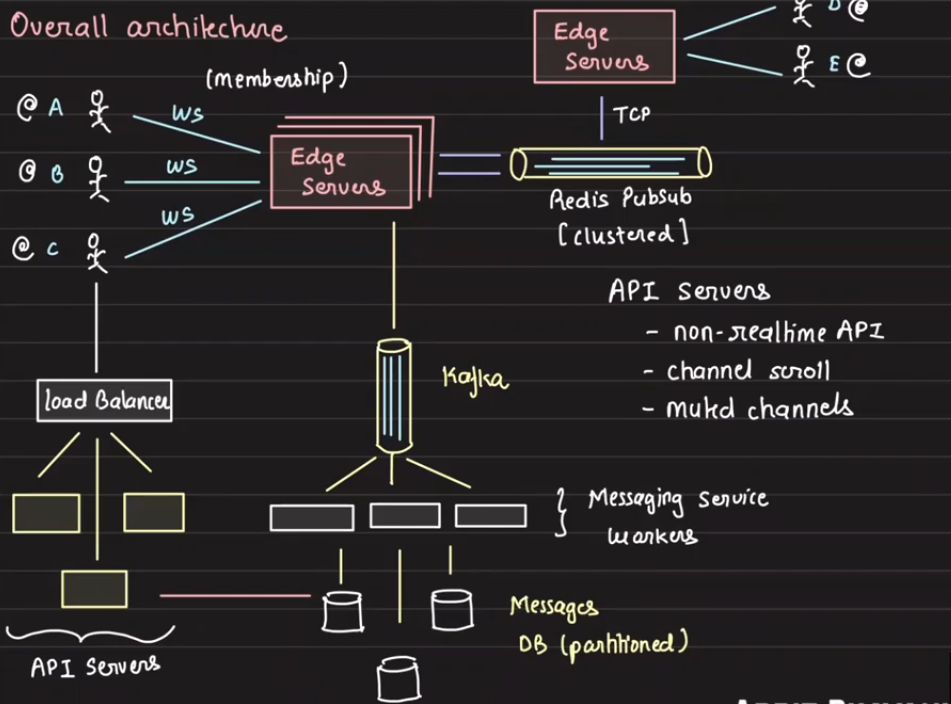

# Lecture 3: NoSQL Databases

1. Non relational databases trade consistency for availability and partition tolerance.
2. Consitency in ACID is different from consistency in CAP theorem.
3. Non relational databases scale as there are non relations

## Types
1. Document Based
2. Column Based
3. Key-Value Based
4. Graph Based

## Document Based
1. MongoDB, CouchDB, ElasticSearch, etc.
2. They are mostly used for caching, session management, and real-time analytics.
3. They are mostly json based.
4. They are closely realted to relational databases.
5. Partial updates are possible. We can say in this document, update this field. This is not possible in key value stores, where we have to update the entire value.
6. We can have nested documents. We can have a document inside a document.

## Key-Value Stores
1. Redis, DynamoDB, etc.
2. Key-wise access patterns. GET a key, SET a key, DELETE a key, etc
3. We can easily shard the data. We can have a key and a hash function that will tell us which shard to go to. Every operation is key based, and we dont have ranges to make queries from, so we know a key is in X shard

## Column Oriented 
1. Used extensively in analytics.
2. Redshift, BigTable, Cassandra, etc.
3. They store the data in columns instead of rows. This makes it easier to do analytics on the data.
4. They have high compression, so disk space is more saved here since columns have homogenous data.

## Graph Databases
1. Stores data in nodes and edges.
2. Neo4j, Amazon Neptune, etc.
3. They are used for social networks, recommendation systems, etc.
4. They store data in adjacency lists. They store the node and the edges that are connected to it. They have special graph algorithms that can be used to traverse the graph.
5. Scaling and managing graph databases is hard. 
6. They are very memory intensive.
7. Whenever we need core graph operations, we use graph databases.
8. Neo4j is the most popular graph database. Others include Neptune, JanusGraph, etc.
9. They can be used in recommendation systems, fraud detection, etc. They use collaborative filtering, and other graph algorithms to make recommendations.

### Messaging System (Slack/WAP/INS/ZM)

