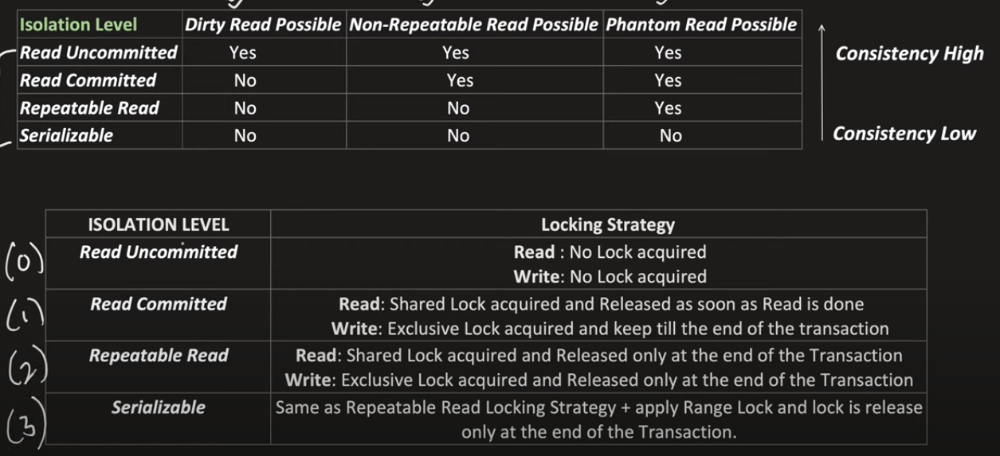

# Concurrency Control

1. A critical section is a piece of code that accesses a shared resource (data structure or device) that must not be concurrently accessed by more than one thread of execution.
2. We have distributed concurrency control and centralized concurrency control.
3. We use distributed concurrency control in distributed systems.
4. We use centralized concurrency control in centralized systems.
5. We have two types of distributed concurrency control:
    1. Pessimistic concurrency control
    2. Optimistic concurrency control
6. Transaction is a unit of work that must be executed atomically and in isolation. It helps in maintaining consistency of the database and achieving integrity.
7. DB locking is a mechanism to prevent two or more transactions from accessing the same data at the same time.
8. We have two types of locks:
    1. Shared lock (read lock) - Another transaction can read the data but cannot modify it.
    2. Exclusive lock - No other transaction can read or modify the data.

9. Isolation level is a measure of how much the concurrent transactions are isolated from each other.
10. Isolation tells that even if multiple transactions are executing at the same time, they should not interfere with each other.

11. Dirty read is a situation when a transaction reads a data that has not yet been committed.
12. Non-repeatable read is a situation when a transaction reads the same data twice and gets different values each time.
13. Phantom read is a situation when a transaction reads a set of rows that satisfy a search condition and another transaction inserts a new row that satisfies the search condition.
14. Optimistic concurrency control is a technique in which we assume that there will be no conflict between the transactions. If there is a conflict, we abort the transaction and restart it. We use read committed and read uncommitted isolation levels in optimistic concurrency control.
15. Pessimistic concurrency control is a technique in which we assume that there will be conflict between the transactions. If there is no conflict, we commit the transaction. We use serializable and repeatable read isolation levels in pessimistic concurrency control.
