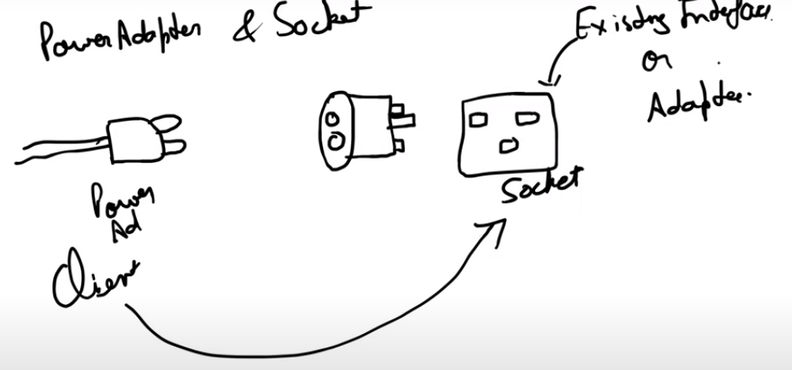

# Adapter Pattern

1. It is a bridge between two incompatible interfaces -  an existing interface and a new interface.

## Implementation
1. We have an adapter interface, which has a method to convert the existing interface to the new interface.
2. We create a concrete class which implements this adapter interface, and we have a method which takes the existing interface as input, and returns the new interface as output.
3. The concrete class has a is-a relationship with the adapter interface, and it has a has-a relationship with the existing interface.
