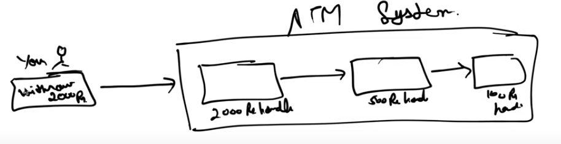

# Chain of Responsibility

## Use cases
1. ATM
2. Vending Machine
3. Logging

## Design
1. This is used in case where we have a chain of objects that can handle a request. Each object in the chain has a reference to the next object in the chain. If one object cannot handle the request, it passes it on to the next object in the chain. This continues until the request is handled or the end of the chain is reached.

2. We have a client and handler (processor/retreiver) .
3. The handler has a fucntion called handleRequest() which takes in a request and returns a response.
4. We have mutliple concrete handlers that implement the handleRequest() function.
5. Each conceete handler has a reference to the next handler in the chain.
6. The client calls the handleRequest() function on the first handler in the chain.
7. We pass the next handler as an argument to the constructor of the current handler.