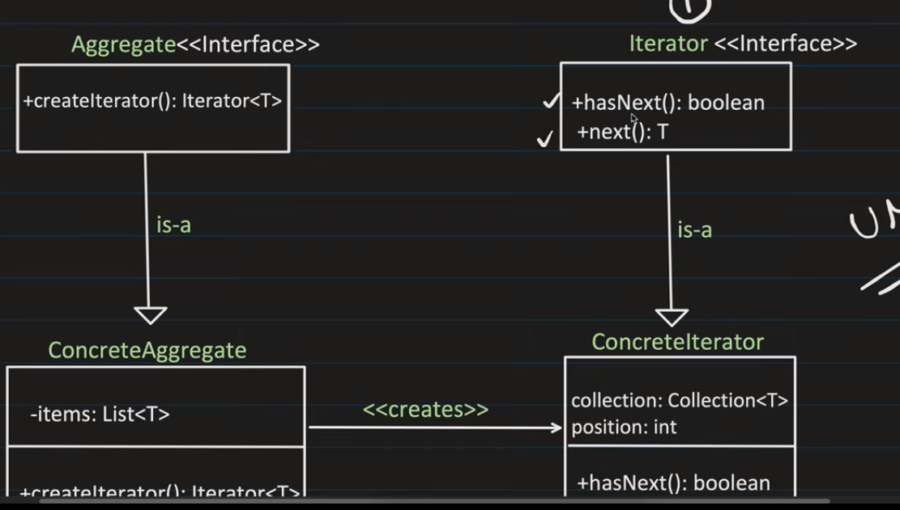

# Iterator Pattern

1. It is a behavioral pattern.
2. It helps in traversing a collection of objects without exposing the underlying implementation.

3. We have an aggregrate and a iterator interfaces.
4. Aggregate is a collection of objects, it has a createIterator() method which returns an iterator.
5. This createIterator() method creates the iterator and returns it.
6. This iterator has a hasNext() method which returns true if there are more elements in the collection and a next() method which returns the next element in the collection.
