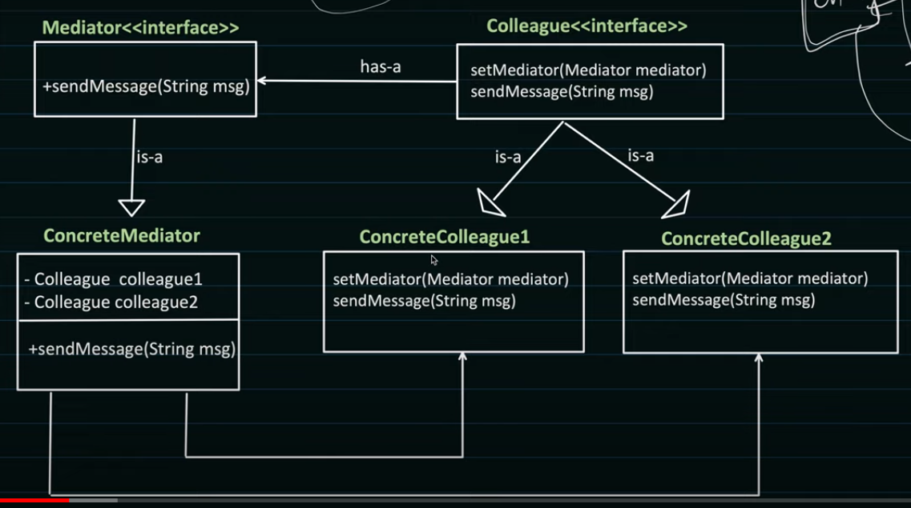

# Mediator Pattern

1. It is a behavioral pattern.
2. It encourages loose coupling by ensuring that instead of components referring to each other explicitly, their interaction is handled through this mediator.

3. Here, let us take an example of auction system. In this system, there are 3 components: Auctioneer, Buyer. Auctioneer is the mediator. Buyers are the colleagues. Buyers do not interact with each other directly. They interact with the Auctioneer. Auctioneer is responsible for handling the interaction between Buyers
4. Buyer has methods to bid and get notified of the bid.
5. The auctioneer has methods to register and unregister buyers, and to notify buyers of the bid.
6. Buyer has a reference to the auctioneer.
7. Auctioneer has a list of buyers.
8. The buyer calls the auctioneer methods to add himself to bid, and bid for the item.
9. When the auctioneer receives a bid, it calls the notify method on all the buyers except the bidder who bid at that time.
10. Now, the buyers can take an action after the bid.
