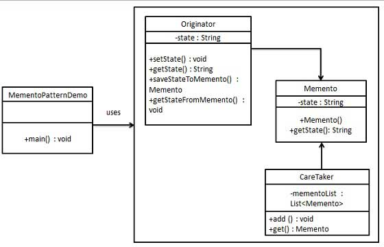

# Memento Pattern

1. It is a behavioral pattern.
2. This pattern is used to store the object history, and for UNDO operation.
3. It is also known as snapshot pattern.
4. It has 3 components - Originator, Memento, Caretaker.
5. It does not expose the objects internal implementation.
6. Originator: The object whose state is to be saved.
7. Memento: The object that stores the state of the originator.
8. Caretaker: The object that is responsible for the memento.

9. 