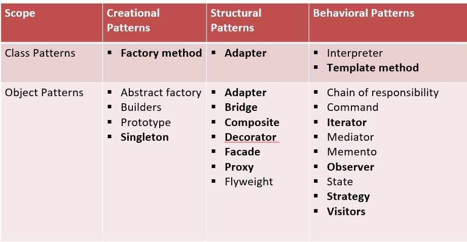

# Design Patterns

Resource - https://www.youtube.com/playlist?list=PL6W8uoQQ2c61X_9e6Net0WdYZidm7zooW

## Types of Design Patterns - 
1. **Creational Patterns** - It gives object creational mechanisms 
2. **Structural Patterns** - Assemble objects and classes into large structures
3. **Behavioral Patterns** - Deals with communication between objects.  

