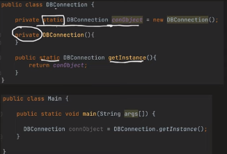
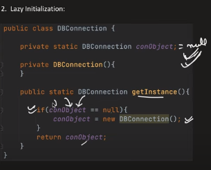
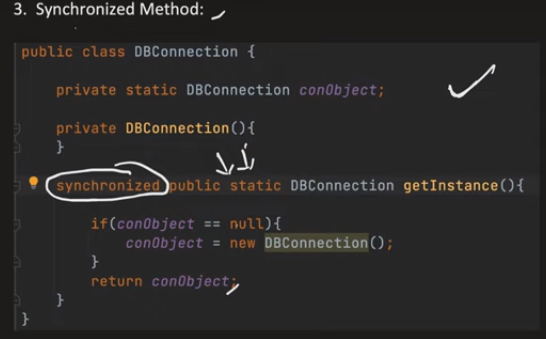
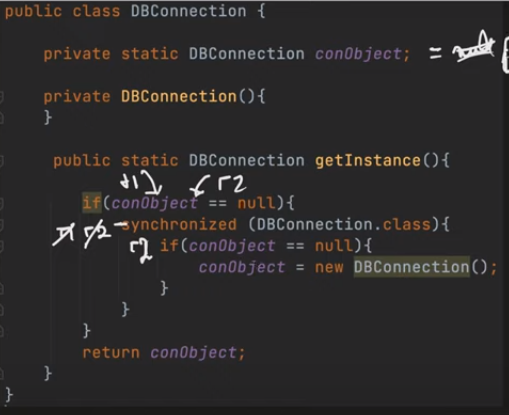

# Singleton Pattern

1. This is used when we want to have only one instance of a class.
2. There are 4 ways to implement this pattern:
    1. Eager initialization
    2. Syncronized initialization
    3. Lazy initialization
    4. Double locking
3. Eager initialization: In the class itself, we create an static variable which is the instance of the class itself and we make the constructor private. So, only the class can create the object and we have a class method which returns this object.

4. Lazy initialization: This is same as in eager, but in here, we dont intitialse the object in class, we initialize it in the getInstance() method. So, the object is created only when the class method is called.

5. Syncronized initialization: This is same as in lazy, but in here, we make the getInstance() method syncronized. So, only one thread can access the method at a time. This is useful when we have multiple threads accessing the method. The problem here is it is pretty slow.

6. Double locking: This is same as in syncronized, but in here, we check if the object is null before we syncronize the method. This is useful when we have multiple threads accessing the method. The problem here is it is pretty slow.

7. There are some memory issues with double locking. 
8. During the creation of singleton object, the JVM performs the following operations:
    1. Allocate memory for the object
    2. Assign the reference to the object
    3. Call the constructor to initialize the object
9. The problem here could be that the compiler could reorder the instructions. 
10. There is another issue called L1 cache invalidation.
11. We use volatile keyword to solve this problem.
12. Volatile has 2 properties:
    1. Visibility: Any changes made to the volatile variable are visible to all the threads and is in the memory.
    2. Atomicity: The volatile variable is not cached in any thread.