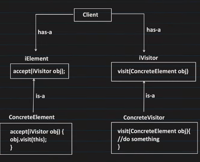

# Visitor Pattern

1. It is a behavioral pattern.
2. It allows you to add new operations to existing classes without changing the structure of those classes.
3. It achieves this by separating the operation from the class structure.
4. It does double dispatch to achieve this.
5. Double dispatch is a mechanism that dispatches a function call to different concrete functions depending on the runtime types of two objects involved in the call.

6. It has element and visitor.
7. Any object on which you have to take out operations is called element.
8. All the type of operations that can be done on a element is called visitor.